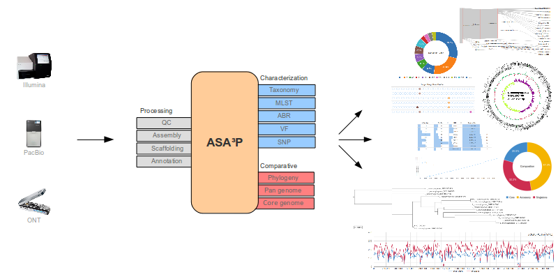

[](https://doi.org/10.1371/journal.pcbi.1007134)
[](https://github.com/oschwengers/asap/blob/master/LICENSE)


[](https://hub.docker.com/r/oschwengers/asap)
[](https://doi.org/10.5281/zenodo.3606299)

# ASA³P - Automatic Bacterial Isolate Assembly, Annotation and Analyses Pipeline



## Contents
- [Description](#description)
- [Features](#features)
  - [Per Isolate](#per-isolate)
  - [Comparative](#comparative)
- [Availability](#availability)
  - [Docker](#docker)
  - [Cloud](#cloud-openstack)
- [Input/Output](#inputoutput)
- [Citation](#citation)
- [License](#license)
- [FAQ](#faq)

## Description
ASA³P is an automatic and highly scalable assembly, annotation and higher-level
analyses pipeline for closely related bacterial isolates.

ASA³P is a fully automatic, locally executable and scalable assembly, annotation
and higher-level analysis pipeline creating results in standard bioinformatics
file formats as well as sophisticated HTML5 documents. Its main purpose is the
automatic processing of NGS WGS data of multiple closely related isolates, thus
transforming raw reads into assembled and annotated genomes and finally gathering
as much information on every single bacterial genome as possible.
Per-isolate analyses are complemented by comparative insights. Therefore, the
pipeline incorporates many best-in-class open source bioinformatics tools and
thus minimizes the burden of ever-repeating tasks. Envisaged as a
preprocessing tool it provides comprehensive insights as well as a general overview
and comparison of analysed genomes along with all necessary result files for subsequent
deeper analyses. All results are presented via modern HTML5 documents comprising
interactive visualizations.

## Features

### Per isolate
- quality/adapter clipping
- assembly (**Illumnia**, **PacBio** & **ONT**)
- scaffolding
- annotation
- taxonomic classification (**Kmer/ANI**, **16S** and **ANI**)
- multi locus sequence typing (**MLST**)
- antibiotic resistance detection
- virulence factor detection
- reference mapping
- SNP detection

### Comparative
- calculation of core/pan genome and singleton genes
- phylogenetic tree creation

## Availability
All necessary files are hostet at Zenodo: [](https://doi.org/10.5281/zenodo.3606299)

Targeting different project sizes, i.e. number of genomes which should be
analysed as a single project, we distribute ASA³P in two versions:
- **Docker**: linux container image for small to medium projects
- **OpenStack**: highly scalable cloud version for (very) large projects

For both the following files are necessary:
- ASA³P tarball containing binaries, 3rd party executables and databases: asap.tar.gz
- configuration template: config.xls

Note:
As the ASA³P tarball contains all databases and 3rd party executables necessary,
it is rather huge (23 Gb zipped, 29 Gb unzipped) and thus, download times may be quit long.
To unzip the tarball a deflating tool supporting multithreadding might be beneficial,
e.g. pigz on linux (`sudo apt install pigz` for Ubuntu).

Additional files:
- comprehensive manual: manual.pdf
- configuration example: config-example.xls

Additional example and benchmark projects are hostet in a distinct repository at Zenodo: [](https://doi.org/10.5281/zenodo.3606760)
   - 4 public *L. monocytogenes* genomes: example-lmonocytogenes-4.tar.gz
   - 32 public *L. monocytogenes* genomes: example-lmonocytogenes-32.tar.gz
   - 8 *E. coli* project merely showing support of different input types: example-ecoli-input.tar.gz

### Docker
For small to medium projects (up to ~200 isolates) but also for the sake of
simplicity, reproducibility and easy distribution, we offer ASA³P as a
**Docker** image hosted at:
**Docker Hub** (https://hub.docker.com/r/oschwengers/asap/). Please, follow the
official instructions (https://docs.docker.com/install) to install Docker.

Setup:
```bash
$ sudo docker pull oschwengers/asap
$ wget https://zenodo.org/record/3780003/files/asap.tar.gz
$ tar -xzf asap.tar.gz
$ rm asap.tar.gz
```

Running an ASA³P Container using the `asap-docker.sh` shell wrapper script:
```bash
$ #<ASAP_DIR>/asap-docker.sh -p <PROJECT_DIR> [-s <SCRATCH_DIR>] [-a ASAP_DIR] [-z] [-c] [-d]
$ asap/asap-docker.sh -p example-lmonocytogenes -s /tmp
```

Parameters & Options:
* `-p <PROJECT_DIR>`: mandatory: path to the actual project directory (containing `config.xls` and `data` directory)
* `-a <ASAP_DIR>`: optional: path to the ASA³P dir in case the script was moved/copied somewhere else
* `-s <SCRATCH_DIR>`: optional: path to a distinct scratch/tmp dir
* `-z`: optional: skip characterization steps
* `-c`: optional: skip comparative analysis steps
* `-d`: optional: enable verbose logs for debugging purposes

**Note**
1. This shell wrapper script should remain within the ASA³P directory in order to
correctly extract related paths. In case the script was moved/copied somewhere else,
you have to provide the path via `-a <ASAP_DIR>`.
2. The script gathers user:group ids and passes these to the Docker container thus,
files created by ASA³P automatically have the correct user ownerships instead of sudo ones.
3. The script will ask for the sudo password as Docker containers can currently only
be executed as sudo. This is pure technical necessity unrelated to ASA³P itself.

**Complete example**:
```bash
$ sudo docker pull oschwengers/asap
$ wget https://zenodo.org/record/3780003/files/asap.tar.gz
$ tar -xzf asap.tar.gz
$ rm asap.tar.gz
$ wget https://zenodo.org/record/3606761/files/example-lmonocytogenes-4.tar.gz?download=1
$ tar -xzf example-lmonocytogenes-4.tar.gz
$ rm example-lmonocytogenes-4.tar.gz
$ asap/asap-docker.sh -p example-lmonocytogenes-4/
```

For further information have a look at the Docker readme (docker/DOCKER.md ).

### Cloud OpenStack
ASA³P's **OpenStack** based cloud version targets the analysis of hundreds to
even thousands of bacterial isolates. Therefore, it features automatic creation,
setup and orchestration of an **SGE** based compute cluster and its entire
underlying infrastructure. Therefore, the **OpenStack** cloud version internally
takes advantage of the BiBiGrid (https://github.com/BiBiServ/bibigrid) framework.
Hence, analysis of thousands of genomes can be achieved in a highly parallel
manner and adequate amount of time. ASA³P takes care of all setup and orchestration
aspects and thus hides away as much technical complexity as possible. For further
information please have a look at our user manual.

In order to trigger an **OpenStack** based cloud project, you need the following
additional cloud related files:
- ASA³P cloud tarball (containing binaries, property files and a customized BiBiGrid version):
[asap-cloud.tar.gz](https://zenodo.org/record/3606300/files/asap-cloud.tar.gz?download=1) (md5sum: c584dedcaf17963a240dbabfad95f608)

Once ASA³P is properly setup you can start it by executing a single shell script:
```bash
$ ~/asap-cloud/asap-cloud.sh -i <INSTANCE_ID> -o <OPEN_STACK_RC_FILE> -p <PROJECT_DIR>
```

Parameters:
* `<INSTANCE_ID>`: VM id of the gateway instance (VM you start ASA³P from)
* `<OPEN_STACK_RC_FILE>`: OpenStack RC file providing cloud and project information
* `<PROJECT_DIR>`: path to the actual project directory (containing `config.xls` and `data` directory)

For a comprehensive and detailed description of how to setup an OpenStack project
and ASA³P therein, please have a look at our manual stored here:
[](https://doi.org/10.5281/zenodo.3606299)

## Input/Output

### Input
ASA³P is able to process raw sequencing reads from Illumina (SE/PE), PacBio (bax.h5/ubam) and ONT
(basecalled as fastq) as well as assembled contigs (fasta) and annotated genomes
(GenBank/EMBL/GFF).

ASA³P expects all input files and information regarding a single execution
(i.e. a "project") within a dedicated directory. All necessary information
(meta information, reference genomes, isolate/sample names and files) are
provided via an Excel config file named *config.xls*.
A corresponding template can be downloaded [here](https://zenodo.org/record/3606300/files/config.xls?download=1).
For further details on how to fill out a proper configuration file, please have
a look at the [manual](https://zenodo.org/record/3606300/files/manual.pdf?download=1)
and the exemplary projects listed above. All input files referenced in a configuration
spreadsheet need to be placed in a subdirectory called *data*.

**Example**:
```
project-dir
├── config.xls
├── data
│   ├── reference-genome-1.gbk
│   ├── reference-genome-2.fasta
│   ├── isolate-1-1.fastq.gz
│   ├── isolate-1-2.fastq.gz
│   ├── isolate-2-1.fastq.gz
│   ├── isolate-2-2.fastq.gz
│   ├── isolate-3.1.bax.h5
│   ├── isolate-3.2.bax.h5
│   ├── isolate-3.3.bax.h5
│   ├── ...
```

### Output
**tl; dr**
Just open your browser and open the **index.html** file located at:
```
project-dir
├── reports   (HTML5 reports)
│   ├── index.html
```

In order to provide a first glimpse into the results of the pipeline, we configured
a public login to a static web server for demonstration purposes only at:
https://www.computational.bio.uni-giessen.de/asap/
```
$ login: asap-test
$ password: asap-test
```

ASA³P stores all output files within the specified project directory
leaving input files untouched:
- empty status file indicating ASA³P current status, one of:
   - *status.running*
   - *status.finished*
   - *status.failed*
- log file (*asap.log*)
- internal configuration file (*config.json*)
- report directory containing **HTML5** report pages (*reports*)

Furthermore, for each analysis ASA³P creates a corresponding subdirectory
containing result files such as:
- empty status file indicating an analysis' status, one of:
   - *status.running*
   - *status.finished*
   - *status.failed*
- **JSON** file (*info.json*) comprising collected and aggregated information
- binary result files in standard file formats (**.fasta**, **.gbk**, **.gff**, **.bam**, **.vcf.gz**, etc...)

Where necessary ASA³P creates subdirectories for each isolate within an
analysis directory.

**Example**:
```
project-dir
├── [state.running | state.finished | state.failed]
├── asap.log   (global logging file)
├── config.xls   (config spreadsheet)
├── config.json   (internal config)
├── reports   (HTML5 reports)
│   ├── index.html
│   ├── ...
├── reads_qc   (quality clipped read files)
│   ├── <sample-name>
│   ├── ├── [state.finished | state.failed]
│   ├── ├── isolate-1-1.fastq.gz
│   ├── ├── isolate-1-2.fastq.gz
│   ├── ├── info.json
│   ├── ...
├── assembly   (assemblies)
│   ├── <sample-name>
│   ├── ├── [state.finished | state.failed]
│   ├── ├── <sample-name>.fasta
│   ├── ├── <sample-name>-discarded.fasta
│   ├── ├── info.json
│   ├── ...
├── scaffolds   (scaffolded contigs)
│   ├── <sample-name>
│   ├── ├── [state.finished | state.failed]
│   ├── ├── <sample-name>.fasta   (scaffolds)
│   ├── ├── <sample-name>-pseudo.fasta   (pseudo genome)
│   ├── ├── info.json
│   ├── ...
├── annotations
│   ├── <sample-name>
│   ├── ├── [state.finished | state.failed]
│   ├── ├── <sample-name>.gbk   (Genbank)
│   ├── ├── <sample-name>.gff   (GFF3)
│   ├── ├── <sample-name>.ffn   (gene sequences)
│   ├── ├── <sample-name>.faa   (protein sequences)
│   ├── ├── info.json
│   ├── ...
├── taxonomy   (taxonomic classfication results)
│   ├── [<sample-name>.finished | <sample-name>.failed]
│   ├── <sample-name>.json
│   ├── ...
├── mlst   (multi-locus sequence typing results)
│   ├── [<sample-name>.finished | <sample-name>.failed]
│   ├── <sample-name>.json
│   ├── ...
├── abr   (antibiotic resistance genes detection)
│   ├── [<sample-name>.finished | <sample-name>.failed]
│   ├── <sample-name>.json
│   ├── ...
├── vf   (virulence factor detection results)
│   ├── [<sample-name>.finished | <sample-name>.failed]
│   ├── <sample-name>.json
│   ├── ...
├── mappings   (reference mappings)
│   ├── [<sample-name>.finished | <sample-name>.failed]
│   ├── <sample-name>.json
│   ├── <sample-name>.bam
│   ├── <sample-name>.bam.bai
│   ├── ...
├── snps   (called single nucleotide polymorphisms)
│   ├── [<sample-name>.finished | <sample-name>.failed]
│   ├── <sample-name>.json
│   ├── <sample-name>.consensus.fasta   (mpileup consensus file)
│   ├── <sample-name>.vcf.gz   (SNPs in variant calling format file)
│   ├── <sample-name>.vcf.gz.tbi
│   ├── <sample-name>.chk   (bcftools stats)
│   ├── <sample-name>.csv   (SNPeff per gene statisics)
│   ├── ...
├── corepan
│   ├── [state.finished | state.failed]
│   ├── info.json
│   ├── core.fasta   (core genome sequences)
│   ├── pan.fasta   (pan genome sequences)
│   ├── pan-matrix.tsv   (pan genome matrix)
│   ├── <sample-name>.json
│   ├── ...
├── phylogeny
│   ├── [state.finished | state.failed]
│   ├── info.json
│   ├── tree.nwk   (phylogenetic tree in newick file)
│   ├── consensus.fasta   (global consensus file)
├── data
```

## Citation

> Schwengers et al. (2020). ASA³P: An automatic and scalable pipeline for the assembly, annotation and higher level analysis of closely related bacterial isolates. PLOS Computational Biology 16(3): e1007134. https://doi.org/10.1371/journal.pcbi.1007134

## License
ASA³P itself is published and distributed under GPL3 license. In contradiction,
some of its dependencies bundled within the ASA³P tarball (asap.tar.gz file) are
published under different licenses, e.g. GPL2, BSD, MIT, LGPL, etc.
A file (README.md) within the ASA³P directory contains a list of all
dependencies and related licenses.

**NOTE**
Please, notice that some bundled dependencies are published under a
**free-for-academic** or **free-for-non-commercial** usage license model.
To our best knowledge this is true for at least the following databases:
- CARD: free for academic usage
- PubMLST: proprietary but free to use

## FAQ
* __Is there a public example project?__
Just download and use one of these exemplary projects containing a tiny set of 4 public
*Listeria monocytogenes* genomes from **SRA**, a larger 32 *L. monocytogenes* set as well as
a comprehensive *E. coli* set covering all potential input data types:
[](https://doi.org/10.5281/zenodo.3606760)

* __Why do I have to pre-basecall ONT reads?__
Unfortunately, there are too many combinations of flow cells, sequencing kits, etc.
We had to ask to put all these information in the config sheets which would blow them up.
Therefore, we decided to outsource these very specific pre-processing step.

* __Can I install ASA³P by myself?__
Yes you can! Nevertheless, we highly encourage to use either the **Docker**
container or the **OpenStack** images. As there are too many possible combinations of
linux distributions and software/database versions, we cannot give any support for this.

* __I'm facing an error/bug. What shall I do?__
If you run into any issues with ASA³P, we'd be happy to hear about it!
Please, start the pipeline with `-d` (verbose debugging logs) and do not hesitate
to file an issue including as much of the following as possible:
- a detailed description of the issue
- the `asap.log` file within your project/data directory
- in case you can already pinpoint the error: the log file of the failed subanalysis
